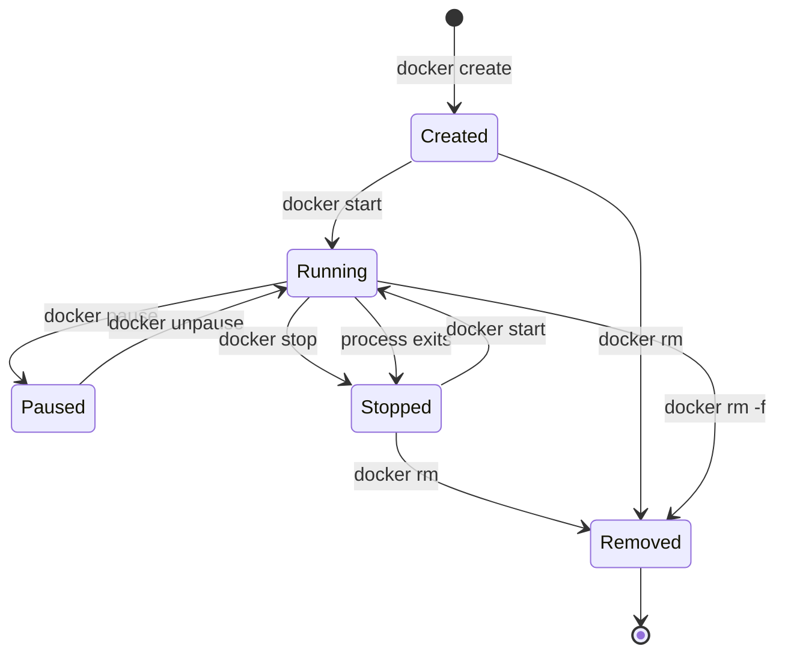

import { Aside } from '@astrojs/starlight/components';

## The Problem

You run a container. It starts, does its work, and eventually you stop it. But what actually happens at each step? Can you restart a stopped container? Is a stopped container still using resources? What is the difference between stopping and removing?

Understanding the container lifecycle helps you manage containers effectively and debug issues like "why did my container exit immediately?" or "why is my disk full of stopped containers?"

## Container States

A container moves through a series of states during its life. Each state represents a different condition, and specific commands trigger transitions between them.



### Created

The container exists but has not started. Its filesystem (image layers + writable layer) is set up, namespaces are configured, but no process is running.

You reach this state with `docker create` — useful when you want to set up a container for later use without starting it immediately.

```bash frame="terminal"
docker create --name my-api -p 3000:3000 node:18-alpine
```

### Running

The container's main process is executing. This is the active state where your application is doing work — serving HTTP requests, processing data, running a database.

```bash frame="terminal"
docker start my-api
```

Or more commonly, `docker run` combines create + start in one step:

```bash frame="terminal"
docker run -d --name my-api -p 3000:3000 node:18-alpine npm start
```

<Aside type="note" title="What Is PID 1?">
Every container has a main process — the one defined by the `CMD` or `ENTRYPOINT` in the image. This process runs as **PID 1** inside the container. When PID 1 exits, the container stops. This is fundamentally different from a VM, where the OS keeps running even if your application crashes.
</Aside>

### Paused

The container's processes are frozen using cgroups' freezer — they stop executing but remain in memory. This is rarely used in production but useful for debugging (freeze a container to inspect its state without it changing).

```bash frame="terminal"
docker pause my-api
docker unpause my-api
```

### Stopped (Exited)

The main process has exited — either because you ran `docker stop` or because the process finished (or crashed). The container still exists with its writable layer intact. You can:

- **Inspect it** — read logs, check the exit code
- **Restart it** — `docker start` puts it back to Running
- **Copy files from it** — useful for debugging crashes

```bash frame="terminal"
docker stop my-api
```

`docker stop` sends **SIGTERM** to PID 1, giving it 10 seconds to shut down gracefully. If the process does not exit, Docker sends **SIGKILL** to force-terminate it.

<Aside type="tip" title="Why SIGTERM First?">
Applications often need to clean up — close database connections, finish writing files, complete in-flight requests. SIGTERM tells the application "shut down gracefully." SIGKILL kills it immediately with no cleanup. This 10-second grace period prevents data corruption.
</Aside>

### Removed

The container is deleted — its writable layer is gone, its namespaces are cleaned up, and it no longer appears in `docker ps -a`. This is permanent.

```bash frame="terminal"
docker rm my-api
```

To remove a running container, you must force it:

```bash frame="terminal"
docker rm -f my-api
```

This sends SIGKILL and removes immediately — use with caution.

## Common Lifecycle Patterns

### Pattern 1: Run and Remove (Disposable Containers)

Run a container, do something, then automatically clean up:

```bash frame="terminal"
docker run --rm alpine echo "Hello from a container"
```

The `--rm` flag removes the container as soon as it exits. Useful for one-off tasks, scripts, and CI/CD jobs. No stopped containers accumulate.

### Pattern 2: Long-Running Services

Start a service and keep it running in the background:

```bash frame="terminal"
docker run -d --name postgres -e POSTGRES_PASSWORD=secret postgres:16-alpine
```

This runs until you explicitly stop it or the process crashes. If it crashes, you can check logs to diagnose:

```bash frame="terminal"
docker logs postgres
```

### Pattern 3: Restart Policies

Tell Docker to automatically restart a container if it crashes:

```bash frame="terminal"
docker run -d --restart unless-stopped --name api my-api:latest
```

Restart policies:

| Policy | Behavior |
|--------|----------|
| `no` | Never restart (default) |
| `always` | Always restart, even after manual stop |
| `unless-stopped` | Restart unless you explicitly stopped it |
| `on-failure` | Restart only if the process exits with a non-zero code |

<Aside type="tip" title="Why unless-stopped?">
`always` restarts even after `docker stop`, which is usually not what you want. `unless-stopped` respects your manual stop commands while still recovering from crashes. This is the most common choice for development.
</Aside>

## The Disk Problem

Every stopped container retains its writable layer on disk. If you run hundreds of containers over time and never remove them, your disk fills up.

```bash frame="terminal" title="See all containers (including stopped)"
docker ps -a
```

```bash frame="terminal" title="Remove all stopped containers"
docker container prune
```

```bash frame="terminal" title="Nuclear option — remove everything unused"
docker system prune -a
```

```d2
direction: right

Running: Running Containers {
  C1: api (running)
  C2: redis (running)
}

Stopped: Stopped Containers {
  S1: old-api-1 (exited)
  S2: old-api-2 (exited)
  S3: test-container (exited)
  S4: debug-session (exited)
}

DiskUsage: "Disk: 4.2 GB used by stopped containers"

Stopped -> DiskUsage: Wasting disk space {
  style.animated: true
}
```

## Inspecting Containers

Understanding the lifecycle also means knowing how to inspect containers at each stage:

```bash frame="terminal" title="View real-time logs"
docker logs -f my-api
```

```bash frame="terminal" title="Execute a command inside a running container"
docker exec -it my-api sh
```

```bash frame="terminal" title="Inspect container details (network, mounts, config)"
docker inspect my-api
```

```bash frame="terminal" title="Check why a container stopped"
docker inspect --format='{{.State.ExitCode}}' my-api
```

An exit code of `0` means the process exited normally. Any non-zero code means an error — and the specific code often hints at the problem (e.g., `137` means killed by SIGKILL, usually out of memory).

## How This Connects to Our Application

When we run our microservice stack:
- **PostgreSQL and Redis** will be long-running containers with `--restart unless-stopped` — they should survive crashes
- **The API** will also be long-running, but in Kubernetes (Day 4), the cluster handles restarts instead of Docker
- **Build containers** (used to build the frontend) will use `--rm` — they do their job and disappear
- We will need to clean up old containers regularly to avoid disk waste

## Key Decisions Made

| Decision | Why |
|----------|-----|
| SIGTERM before SIGKILL | Gives applications time to shut down gracefully — close connections, flush writes, complete requests. |
| Stopped containers persist | Allows you to inspect logs and state after a crash. Essential for debugging production issues. |
| `--rm` for disposable containers | Prevents disk waste from one-off tasks. Enforces the "containers are disposable" mindset. |
| `unless-stopped` restart policy | Best balance — recovers from crashes but respects manual stops. |
